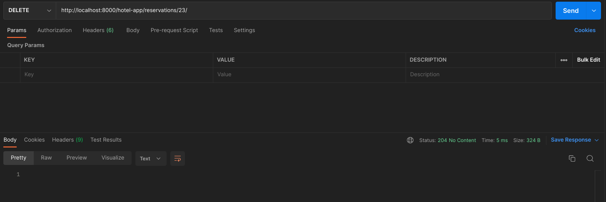

# HOTEL RESERVATION APP

Una API construida en Django REST Framework que permite ver, crear, actualizar y eliminar reservas de hotel

Las rutas para la aplicación están en reservas.urls y se puede acceder por **"hotel-app/reservations/"**


**Depende de el método que mandes recibirás una respuesta**

## API Reference

### Get all reservations > Muestra todas las reservaciones

```http
  GET /hotel-app/reservations/
```


### Get a reservation > Muestra una reservación

```http
  GET /hotel-app/reservations/${id}
```


### POST reservation > Crea una nueva reservación

```http
  POST /hotel-app/reservations/
```


### PUT reservation > Actualiza una reservación existente

```http
  PUT /hotel-app/reservations/
```


### DELETE reservation > Elimina una reservación

```http
  DELETE /hotel-app/reservations/${id}
```

#### After delete when you search the reservation shows a message not found


## **GRACIAS**